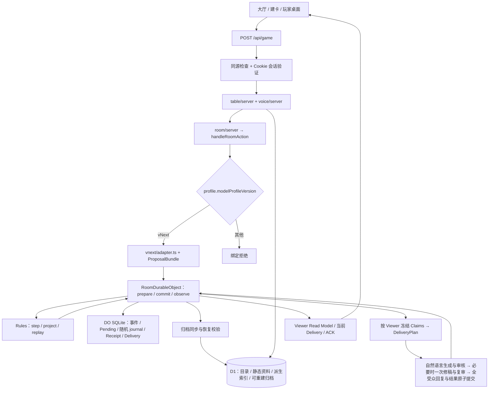

# 烛帷 repo map

核对日期：2026-09-07。分支 `cloudflare`，检查点 `72201ea`（`chore: checkpoint the uncommitted vNext working tree`）。

核对是在 `258caee` 加未提交工作树上做的，随后这棵工作树被一次性提交为 `72201ea`：507 个文件、85087 行，其中 369 个首次进入版本库。因此这份地图与 HEAD 内容一致，但**版本库历史只追溯到 `72201ea`** —— 对 vNext 的多数文件做 `git log` 或 `git blame` 只会看到这一个提交，改动理由要去 [refactor-log.md](../refactor-log.md) 和对应的 `vnext-*-validation.md` 找。`git stash list` 另有一条 2026-08-31 的 codex 保存记录，不要动。本次只运行了 `npm run typecheck`（exit 0）作为整树可编译的证据，没有运行测试、构建、模型探针或部署。

产品行为以 [SPEC 0001](../specs/0001-llm-kp-responsibility-contract.md) 和已批准补充 SPEC 为准。本图记录的是当前实现位置与调用关系，实现限制不是产品能力上限；标识、hash 和版本号一律以源码为准，本图抄录的值仅供定位。

2026-09-09 局部补充：新增剧本写作、开场准备及其定向验收入口；其余运行时说明仍为上述核对日期的快照。

## 先读哪里

| 要解决的问题 | 入口 |
| --- | --- |
| 任务范围、开发期验证、发布权限 | [AGENTS.md](../../AGENTS.md) |
| KP 与 Rules 的权力、公正、危险及 A–O 验收 | [SPEC 0001](../specs/0001-llm-kp-responsibility-contract.md) |
| vNext 冻结上下文、稀疏定义、原子提案与 Claims | [SPEC 0016](../specs/0016-coarse-forms-frozen-adjudication-context-and-typed-claims.md)、[ADR 0015](../adr/0015-coarse-forms-frozen-context-and-typed-claims.md) |
| 私有 Form、上下文检索与旁白边界 | [SPEC 0015](../specs/0015-private-form-context-rag-and-narration.md)、[ADR 0014](../adr/0014-private-proposal-derived-retrieval-and-publication-boundary.md) |
| 其他产品合同及取代关系 | [规格索引](../specs/README.md) |
| 领域词汇 | [CONTEXT.md](../../CONTEXT.md) |
| 剧本写作、关键物品 JSON 与角色开场知识 | [写作指导](module-writing-guide.md)、[黑橡开场补充](black-oak-opening-preparation.md) |
| 当前该做什么、下一步卡在哪 | [任务与指导文档索引](README.md) |
| vNext 完整达标范围与生产替换顺序 | [vNext 生产替换 TODO](vnext-production-todo.md) |
| 历史决定、实际命令与退出码 | [refactor-log.md](../refactor-log.md)，按关键词搜索，不通读 |
| 危害与物品那一段的设计理由 | [handoff-hazards-and-items.md](handoff-hazards-and-items.md)，基线 `0a86fc0` |

根目录 `handoff.md` 曾是临时交接文件，已于 ec5a5f5 删除，当前待办以 [任务与指导文档索引](README.md) 为准；`cee6834` 时期的旧检查点（“没有接入 vNext-2 Room 消费端”“Linux worktree 路径”那份）可用 `git show ec5a5f5^:handoff.md` 取回。按主题归档的历史交接留在本目录，例如 [handoff-hazards-and-items.md](handoff-hazards-and-items.md)。

## 整体调用图



## 代码规模与分布

| 位置 | 文件 | 行 | 说明 |
| --- | --- | --- | --- |
| `app/_runtime/lib/rules/v2` | 92 | ~68k | Rules 内核实现，最大的单一目录 |
| `app/_runtime/lib/room` | 18 | ~20k | Room 编排与 DO；`durable-object.ts` 一个文件约 10.5k 行 |
| `app/_runtime/lib/kp`（含 `vnext`、`vnext/context`） | 37 + 30 + 14 | ~34k | V3 生产 KP 与 vNext 开发链 |
| `app/_runtime/lib/rules/profiles` | 22 | ~6k | 版本化 runtime profile 与解释器 |
| `app/_runtime/components` | 4 + ui | ~6k | 桌面、建卡、库存、战术地图 |
| `tools` | 10 + `lib/`† | ~6k | 模块门、探针、有界评测 |
| `tests` | 当前按功能与环境递归发现 | 以源码为准 | [测试目录与命令](../../tests/README.md)，运行 `npm run test:list` 查看当前清单 |

## 首次进入版本库于 `72201ea` 的源码（† 标记的来源）

下列 72 个源码文件在 `258caee` 时还不在版本库里，是随检查点一次性提交进来的。它们是 vNext 大部分新能力的实现所在；地图里的 † 就是这批文件的标记，含义是「没有 `72201ea` 之前的历史」。

- `app/_runtime/lib/rules/v2/`：`ability-operation`、`atomic-world-input`、`authored-materialization`、`character-inference`、`combat-encounters`、`condition-consequences`、`condition-mechanics`、`due-activities`、`dynamic-location-shapes`、`dynamic-locations`、`effect-phase`、`environment-hazard-schema`、`frozen-player-choice`、`hazard-lifecycle`、`inventory-operations`、`item-assemblies`、`item-assembly-shapes`、`item-authority-vnext`、`item-resources`、`knowledge-expression`、`knowledge-identities`、`knowledge-records`、`knowledge-review`、`narrative-commitments`、`npc-decision-context`、`npc-plan-formation`、`public-expression`、`social-commitments`、`social-interaction`、`social-primitives`、`time-passage`、`time-passage-binding`、`world-effects`、`world-facts`、`world-interaction-conditions`、`world-interaction-costs`、`world-interaction-hazards`、`world-interaction-prefix`、`world-interaction-randomness`、`world-interaction-targets`
- `app/_runtime/lib/kp/vnext/`：`actor-plan-decision`、`adapter`、`authored-proposal-contract`、`feasibility-lowering`、`materialization-authority`、`model-call-scope`、`proposal-capabilities`、`proposal-check-owner`、`proposal-context`、`proposal-diagnostics`、`proposal-filling-interface`、`proposal-guidance`、`proposal-producer-contract`、`proposal-reference-slots`、`proposal-repair-plan`、`runtime-policy`，以及 `context/fact-relevance`、`context/knowledge-relevance`、`context/narrative-continuity`、`context/npc-decision`、`context/runtime-requirements`
- `app/_runtime/lib/kp/`：`deepseek-strict-schema-compaction`、`narration-context`、`narration-vnext`、`pending-decision-policy`
- `app/_runtime/lib/room/`：`actor-plan-transport`、`actor-plan-transport-types`、`narration-context`、`runtime-configuration`、`vnext-proposal-invocation`
- 其他：`app/_runtime/lib/dnd/class-resources`、`app/_runtime/lib/module/npc-semantics`、`app/_runtime/lib/rules/profiles/semantic-templates`、`tools/lib/vnext-authored-probe-fixture.mjs`、`tools/run-deepseek-vnext2-authored-probe.mjs`

同一批还带进 88 个测试（多数是 `tests/kp-vnext-*.test.mjs`）、5 个 `tests/fixtures/*` 和 203 份 `docs/agent/` 回执。

## 页面、请求与身份

| 位置 | 职责和直接下游 |
| --- | --- |
| [hall/page.tsx](../../app/hall/page.tsx)、[hall-client.tsx](../../app/hall/hall-client.tsx) | 大厅与房间目录交互 |
| [table/[code]/page.tsx](../../app/table/[code]/page.tsx)、[table-client.tsx](../../app/table/[code]/table-client.tsx) | 玩家桌面宿主；React Query 周期读取 `fetchTable`，当前为约 3 秒轮询 |
| [play-table.tsx](../../app/_runtime/components/play-table.tsx) | 行动输入、待决、骰子、旁白与桌面交互的主展示组件 |
| [character-wizard.tsx](../../app/_runtime/components/character-wizard.tsx)、[inventory-panel.tsx](../../app/_runtime/components/inventory-panel.tsx)、[tactical-map.tsx](../../app/_runtime/components/tactical-map.tsx) | 建卡、物品与地图展示；只消费服务端结果与 Viewer 投影 |
| [table/client.ts](../../app/_runtime/lib/table/client.ts)、[authoritative-client.ts](../../app/_runtime/lib/table/authoritative-client.ts) | 客户端命令调用与权威行动的提交/恢复状态 |
| [api/game/route.ts](../../app/api/game/route.ts) | 唯一游戏/语音命令入口：白名单 `commands` 表，`POST` 先 `assertSameOrigin` 再 `requireApiUser`，然后分发 |
| [auth.server.ts](../../app/_lib/auth.server.ts)、[api/_shared.ts](../../app/api/_shared.ts) | Cookie 会话、D1 token 摘要与用户验证；注册/登录/登出/会话路由在 `app/api/auth/` |
| [platform/server-fn.ts](../../app/_runtime/lib/platform/server-fn.ts) | `createServerFn` 包装；middleware 标记本身不执行鉴权，不能据此认定 handler 已验证身份 |
| [table/server.ts](../../app/_runtime/lib/table/server.ts)、[table/authoritative.ts](../../app/_runtime/lib/table/authoritative.ts) | 房间/席位/角色服务，组装行动与桌面读取模型；进入 `room/server.ts`，把 Rules 结果转成玩家响应 |
| [voice/server.ts](../../app/_runtime/lib/voice/server.ts)、[voice/current-delivery.ts](../../app/_runtime/lib/voice/current-delivery.ts) | 转写与当前交付 TTS；检查权限、Delivery 身份与过期 |

可信 `userId` 在服务端转成 Principal；DO 继续核验会话版本、活跃席位、角色控制与行动权限。客户端文本、表单和地图不直接写机械状态。

## Room Authority 与存储

| 位置 / 符号 | 职责 |
| --- | --- |
| [room/server.ts](../../app/_runtime/lib/room/server.ts) · `runAuthoritativeRoomAction` | 从请求环境取 Room RPC，**校验 `profile.modelProfileVersion` 是 vNext，否则拒绝绑定**，绑定每请求调用计数域；管理成员、队伍、观察、ACK、更正与旁白重试 |
| [room/action.ts](../../app/_runtime/lib/room/action.ts) · `handleRoomAction` / `handleRoomCorrection` / `handleViewerNarrationRecovery` | 行动编排的公共 Interface；组合 Authority 与 KP capability，管理 prepare、提案、提交与发布；`actionState` 与 `narrationState` 分开表达 |
| [room/durable-object.ts](../../app/_runtime/lib/room/durable-object.ts) · `RoomDurableObject` | 活跃房间权威。方法面：`initializeAuthoritative` / `prepare` / `commit` / `observe` / `acknowledge` / `commitCorrection` / `resumePlayerRandomness` / `publishDelivery` / `beginVNextProposalInvocation` / `completeVNextProposalInvocation` / 归档导出恢复 / `alarm` |
| [room/authority-store.ts](../../app/_runtime/lib/room/authority-store.ts) · `AuthoritativeRoomStore` | DO SQLite schema 与事务：genesis、连续事件（房间状态与候选状态按块存 `authority_json_blobs`）、scope versions、receipt、随机授权/批次、逐 Viewer 发布与 ACK |
| [room/proposal-invocation-recovery.ts](../../app/_runtime/lib/room/proposal-invocation-recovery.ts)、[story-external-invocation-journal.ts](../../app/_runtime/lib/room/story-external-invocation-journal.ts)、[story-creation-store.ts](../../app/_runtime/lib/room/story-creation-store.ts) | 提案显式恢复的物理调用关联、一次派发及原来源预算；Room 核验未冻结资格，原调用保留晚到证据但失去裁定资格。对应 [ADR 0025](../adr/0025-explicit-proposal-invocation-recovery.md) |
| [room/runtime-configuration.ts](../../app/_runtime/lib/room/runtime-configuration.ts)† | **代际闸门**：只有请求环境 `ZHUWEI_VNEXT_LOCAL === "true"` 时才接受 vNext Profile / workflow / runtime manifest；否则一律走 `validateV3RoomBinding`。没有客户端输入和模块级 env 能选择代际 |
| [room/v3-binding.ts](../../app/_runtime/lib/room/v3-binding.ts)、[proposal-adapter.ts](../../app/_runtime/lib/room/proposal-adapter.ts) | 房间绑定校验与提案归一；V5 的环境特技降级已随 ADR 0034 删除 |
| [room/vnext-adjudication-bridge.ts](../../app/_runtime/lib/room/vnext-adjudication-bridge.ts)、[vnext-proposal-invocation.ts](../../app/_runtime/lib/room/vnext-proposal-invocation.ts)† | vNext 上下文准备、读取集复核、提案降级的注入 Interface；两轮调用的合法状态转换与重试等待 |
| [room/actor-plan-transport.ts](../../app/_runtime/lib/room/actor-plan-transport.ts)† | NPC 计划决策的传输 capability，与提案共用 binding 与预算 |
| [room/narration-context.ts](../../app/_runtime/lib/room/narration-context.ts)†、[kp/narration-context.ts](../../app/_runtime/lib/kp/narration-context.ts)† | 从 Viewer 已授权投影 / Claims / 相关对话选择表达材料，独立 hash 绑定并冻结；DO 保存，首发与恢复复用，不重写 Rules Claims |
| [room/archive.ts](../../app/_runtime/lib/room/archive.ts) | 归档构造、校验、分批写 D1、恢复读取；D1 归档不是第二个活跃裁决源 |
| [room/telemetry.ts](../../app/_runtime/lib/room/telemetry.ts)、[platform/failure-diagnostics.ts](../../app/_runtime/lib/platform/failure-diagnostics.ts)、[authority-telemetry.ts](../../app/_runtime/lib/room/authority-telemetry.ts)、[kp/diagnostic-telemetry.ts](../../app/_runtime/lib/kp/diagnostic-telemetry.ts) | 失败分类与脱敏遥测。统一日志保留 `failureReason`、`failureStage`、`failureRetryability` 和有证据的 HTTP 状态；具体原因在模型、调用账本、Room、归档与 HTTP 包装前提取，经固定私有 RPC 消息保留。没有依据时为 `unclassified` / `unknown`；日志的可重试性是诊断信息，不授予重发权限。公开错误码和玩家恢复策略仍由原合同决定 |
| [platform/game-request-diagnostics.ts](../../app/_runtime/lib/platform/game-request-diagnostics.ts)、[diagnose-game.mjs](../../tools/diagnose-game.mjs) | 页面故障编号关联 HTTP 尝试、原提交与公开回执哈希；支持有界历史查询、实时采集及离线筛选。权限与使用方式见[故障排查](diagnostics.md)。 |
| [db/schema.ts](../../db/schema.ts)、[db/index.ts](../../db/index.ts)、[lib/db.ts](../../app/_runtime/lib/db.ts) | D1 schema 与访问。表：`auth_users`、`auth_sessions`、`rooms`、`room_members`、`characters`、`kp_static_chunks`、`kp_static_corpus_profiles`，以及 genesis / event / projection-audit / checkpoint 四张归档表；迁移只增，在 [drizzle/](../../drizzle/) |
| [module/registry.ts](../../app/_runtime/lib/module/registry.ts)、[module/schema.ts](../../app/_runtime/lib/module/schema.ts)、[npc-semantics.ts](../../app/_runtime/lib/module/npc-semantics.ts)† | 版本化模组、故事锚点与初始资料；活跃运行后的事实由 Room/Rules 固化 |
| [module/preparation.ts](../../app/_runtime/lib/module/preparation.ts)、[black-oak-will-preparation.json](../../app/_runtime/lib/module/black-oak-will-preparation.json) | 开场物品与知识目录；校验精确模组引用、唯一实物和知识受众，由 DO 初始化合并到 Rules genesis；后续读取房间状态 |

`RoomDurableObject` 以事件回放重建权威状态，并使用受事件头约束的回放缓存。模型、网络、检索都在原子提交之外；提交事务只负责验证并保存权威结果。定位问题沿 `请求 → 身份/状态 → handleRoomAction → DO/Rules → 投影/发布` 走。

## Rules Module

外部 Interface 只有 [rules/index.ts](../../app/_runtime/lib/rules/index.ts) 的 `step / project / replay`（转发到 [v2-runtime.ts](../../app/_runtime/lib/rules/v2-runtime.ts)）。下面是内部导航；测试和生产调用者仍从公共 Interface 验证机械行为。

| 内部位置 | 负责什么 |
| --- | --- |
| [v2-runtime.ts](../../app/_runtime/lib/rules/v2-runtime.ts)、[profiles/registry.ts](../../app/_runtime/lib/rules/profiles/registry.ts)、[profiles/manifests.ts](../../app/_runtime/lib/rules/profiles/manifests.ts) | 完整 runtime manifest 校验、解释器分发、状态/事件 hash 与 replay；按精确标识与 hash 选解释器 |
| [v2/actions.ts](../../app/_runtime/lib/rules/v2/actions.ts) · `stepAuthoritativeWorld` | 通用动作分发与随机续接；连接 causal、world interaction、campaign、multiplayer、combat |
| [v2/events.ts](../../app/_runtime/lib/rules/v2/events.ts) | typed event 校验、`createEventTransition`、`foldEvent`；领域 fold 在相邻 `*-events.ts` |
| [v2/projector.ts](../../app/_runtime/lib/rules/v2/projector.ts)、[v2/observer-delta.ts](../../app/_runtime/lib/rules/v2/observer-delta.ts) | 玩家 / NPC / KP 的安全读取模型与观察者变化 |
| [v2/claims.ts](../../app/_runtime/lib/rules/v2/claims.ts)、[authority-read.ts](../../app/_runtime/lib/rules/authority-read.ts) | 从提交范围生成并验证按 Viewer 冻结的可叙述主张 |
| [v2/world-interactions.ts](../../app/_runtime/lib/rules/v2/world-interactions.ts) 与 `world-interaction-*.ts`† | vNext 交互计划、分支、冻结随机、原子束与有限机械效果；条件、成本、危害、目标、前缀、随机各自成文件 |
| [v2/ability-operation.ts](../../app/_runtime/lib/rules/v2/ability-operation.ts)† | 已注册能力（法术/职业资源）的统一执行口，复用 combat/campaign executor |
| [v2/semantic-definitions.ts](../../app/_runtime/lib/rules/v2/semantic-definitions.ts)、[authored-materialization.ts](../../app/_runtime/lib/rules/v2/authored-materialization.ts)†、[profiles/semantic-templates.ts](../../app/_runtime/lib/rules/profiles/semantic-templates.ts)† | 稀疏定义物化、修订、引用验证；KP 完整作者化定义走同一 Ability 编译与 Item 校验，模板目录不是白名单 |
| [profiles/ability-compiler.ts](../../app/_runtime/lib/rules/profiles/ability-compiler.ts)、[v2/environment-hazards.ts](../../app/_runtime/lib/rules/v2/environment-hazards.ts)、[hazard-lifecycle.ts](../../app/_runtime/lib/rules/v2/hazard-lifecycle.ts)† | 通用 Ability 编译；危害以 `mechanicsRef` 引用冻结 Ability，触发关系由定义注册派生 |
| [v2/items.ts](../../app/_runtime/lib/rules/v2/items.ts)、`item-*.ts`†、[inventory-operations.ts](../../app/_runtime/lib/rules/v2/inventory-operations.ts)† | ItemDefinition / ItemEntry、持有装备使用转移消耗、组件拆装、实物存量与职业资源隔离；权威在 `campaignRuntime.itemSystem` |
| [v2/combat-actions.ts](../../app/_runtime/lib/rules/v2/combat-actions.ts)、[combat-events.ts](../../app/_runtime/lib/rules/v2/combat-events.ts)、[damage.ts](../../app/_runtime/lib/rules/v2/damage.ts)、[condition-mechanics.ts](../../app/_runtime/lib/rules/v2/condition-mechanics.ts)† | 战斗行动、伤害、豁免、状态与持续效果 |
| [v2/campaign-actions.ts](../../app/_runtime/lib/rules/v2/campaign-actions.ts)、[campaign-events.ts](../../app/_runtime/lib/rules/v2/campaign-events.ts)、[time-passage.ts](../../app/_runtime/lib/rules/v2/time-passage.ts)†、[due-activities.ts](../../app/_runtime/lib/rules/v2/due-activities.ts)† | 动态定义注册、物品物化、长团 / 虚构时间 / Activity 到期 |
| [v2/social-*.ts](../../app/_runtime/lib/rules/v2/social-interaction.ts)†、[npc-plan-formation.ts](../../app/_runtime/lib/rules/v2/npc-plan-formation.ts)†、[knowledge-*.ts](../../app/_runtime/lib/rules/v2/knowledge-records.ts)† | 社交原语与承诺、NPC 计划形成、知识记录与表达 |
| [v2/dynamic-locations.ts](../../app/_runtime/lib/rules/v2/dynamic-locations.ts)†、[world-facts.ts](../../app/_runtime/lib/rules/v2/world-facts.ts)†、[narrative-commitments.ts](../../app/_runtime/lib/rules/v2/narrative-commitments.ts)† | 地点/通道、世界事实记忆、叙述承诺 → 引用时固化 |
| [v2/atomic-world-input.ts](../../app/_runtime/lib/rules/v2/atomic-world-input.ts)†、[frozen-player-choice.ts](../../app/_runtime/lib/rules/v2/frozen-player-choice.ts)† | Rules 私有候选、已付成本、冻结骰面与续接位置；公开回答沿用 native pending |

## KP：现役 vNext 链

V5 私有 Form 提案路径已按 [ADR 0034](../adr/0034-remove-the-v5-private-form-proposal-path.md) 删除，vNext 是唯一提案路径。下表只列现役位置。

| 层 | 现役实现 |
| --- | --- |
| Room 宿主 | `worker/index.ts` 导出的 `RoomDurableObject`；`runtime-configuration.ts`† 校验房间绑定，`npm run dev:vnext` 只隔离本地 D1/DO 目录与调用预算 |
| Runtime | [profiles/vnext-world-interaction.ts](../../app/_runtime/lib/rules/profiles/vnext-world-interaction.ts) 的 `VNEXT_STAGE3_RUNTIME_PROFILE_MANIFEST` |
| 上下文 | [vnext/context/index.ts](../../app/_runtime/lib/kp/vnext/context/index.ts) + [required-context.ts](../../app/_runtime/lib/kp/vnext/required-context.ts)：Availability、五态要求、epistemic/read set、引用目录与冻结 |
| 提案 | [vnext/adapter.ts](../../app/_runtime/lib/kp/vnext/adapter.ts)† → [proposal-provider.ts](../../app/_runtime/lib/kp/vnext/proposal-provider.ts) → [proposal-schema.ts](../../app/_runtime/lib/kp/vnext/proposal-schema.ts) / [proposal-capabilities.ts](../../app/_runtime/lib/kp/vnext/proposal-capabilities.ts)† / [proposal-guidance.ts](../../app/_runtime/lib/kp/vnext/proposal-guidance.ts)† |
| 校验与修订 | [proposal-validator.ts](../../app/_runtime/lib/kp/vnext/proposal-validator.ts) → [proposal-diagnostics.ts](../../app/_runtime/lib/kp/vnext/proposal-diagnostics.ts)† → [proposal-provider.ts](../../app/_runtime/lib/kp/vnext/proposal-provider.ts)；[vnext-proposal-invocation.ts](../../app/_runtime/lib/room/vnext-proposal-invocation.ts) 由 Room 证明原稿、诊断与调用资格，KP 提交完整修订稿，整份重验后才冻结执行 |
| 模型传输 | [provider.ts](../../app/_runtime/lib/kp/provider.ts)、[deepseek.ts](../../app/_runtime/lib/kp/deepseek.ts)、[deepseek-strict-tool.ts](../../app/_runtime/lib/kp/deepseek-strict-tool.ts) + [model-call-scope.ts](../../app/_runtime/lib/kp/vnext/model-call-scope.ts)† 每请求调用上限、[invocation/assemble.ts](../../app/_runtime/lib/kp/vnext/invocation/assemble.ts) 组装与预算门 |
| Room 执行 | [room-bridge.ts](../../app/_runtime/lib/kp/vnext/room-bridge.ts) → [proposal-graph.ts](../../app/_runtime/lib/kp/vnext/proposal-graph.ts) / [proposal-bundle-lowering.ts](../../app/_runtime/lib/kp/vnext/proposal-bundle-lowering.ts) → Rules |
| 旁白 | Room 冻结候选 Claims → DeliveryPlan；新结果由 [narration-text.ts](../../app/_runtime/lib/kp/narration-text.ts) 自然语言生成，再用 `status/issues.reason` 做实质审核，旧冻结请求继续由 [narration-vnext.ts](../../app/_runtime/lib/kp/narration-vnext.ts)† 解释；[narration-publication.ts](../../app/_runtime/lib/kp/narration-publication.ts) 分级决定发布或一次修稿与复审，并供 Room/归档共用阶段构造及正文核验。逐受众发布与恢复由 [authoritative.ts](../../app/_runtime/lib/kp/authoritative.ts) 的 narrate 半边执行。`authority_provisional_*` 保存未提交的机械与回复；`provisional-events.ts` 在相关依赖复核后重排无关并发后的候选地址；Room 在全部回复就绪时一并提交，截止或终局失败取消并归档审计证据 |

### vNext 当前冻结的标识（读自 [runtime-policy.ts](../../app/_runtime/lib/kp/vnext/runtime-policy.ts)† 与 [proposal-provider.ts](../../app/_runtime/lib/kp/vnext/proposal-provider.ts)）

改这些值等于换协议，必须同步 workflow hash、Room 绑定与直接消费者。**文档里的版本号经常落后于源码，一律以源码为准。**

- Profile：`modelProfileVersion = authoritative-kp-deepseek-vnext-local-v1`，`promptPolicyVersion = kp-vnext-authority-policy-v2`，`actionLanguageVersion = kp-vnext2-proposal-bundle-v1`
- Workflow：`workflowRef = kp-vnext-local-workflow-v1`，`validationStatus = "development"`
- Parser 合同：`version = kp-vnext2-proposal-parser-v40`，`schemaRetrieval = flat-type-selection-then-exact-selected-forms-terminal-two-step-three-v4`，`localValidation = closed-domain-typed-authored-canonical-time-passage-and-npc-plans-v6`，`referenceSelection = frozen-authorized-read-bound-basis-and-classed-visible-subjects-v3`，`correctionPolicy = server-proven-plan-confirmation-exact-number-and-frozen-intent-echo-once-v9`，`unparsedOutputPolicy = journal-proved-single-reemit-of-the-same-question-no-server-content-v1`
- 修订票据：`zhuwei.kp-proposal-bundle-repair-ticket/vnext-5`
- 调用策略：`selections 1 / proposals 1 / terminalMaximumTotal 2 / stepCorrections 1 / stepMaximumTotal 3`；NPC 决策 `decisions 1 / corrections 0`
- 预算：`contextWindowTokens 64000`、`completionReserveTokens 4000`、`safetyMarginTokens 2000`

### 两轮填表怎么走

1. `offer_kp_proposal_bundle`：模型只填扁平 `requestedCapabilities`，选类型不填内容。
2. `submit_kp_proposal_bundle`：服务器按所选能力从同一领域 schema 派生小表单，模型只填 `decision`；外壳、根依据并集、producer、静态模板 hash 与类型化依赖由服务器生成。
3. 校验失败时服务器先证明有界修复计划，`correct_kp_proposal_bundle` 只让模型确认并填获准摘要，最多一次。
   完全没解析出草稿时改走一次重发：同一工具面、同一冻结上下文，服务器只说明字节在哪里不再是 JSON，不提供任何内容，Room 从保存响应自行证明这一次调用合法。合法 JSON 的策略拒绝（重复成员）和根边界可恢复的错误都不走这条路，见[回执](./receipts/vnext-unparsed-reemit-validation.md)。
4. [vnext-proposal-invocation.ts](../../app/_runtime/lib/room/vnext-proposal-invocation.ts)† 用保存的响应证明后继调用合法，两轮正文绑定同一冻结 contextHash。

**引用槽是枚举，不是自由字符串。**[proposal-context.ts](../../app/_runtime/lib/kp/vnext/proposal-context.ts) 的 `proposalSubjectRefs(context, class)` 从同一冻结上下文按对象类别投影候选面：生物、物理主体、物品条目各是一类，身份一律与 `entryRef` 比对，定义、目录、知识记录与私有决策包装不能冒充它们描述的对象。`basisRefs` 用 [required-context-runtime.ts](../../app/_runtime/lib/kp/vnext/required-context-runtime.ts)† 的 authority ∩ read 集合，`social` 用 `npcSourceChoices`。这些集合作为 schema 枚举下发，模型结构上填不出界；Rules 的完整目标判定仍是准入权威，可能再拒绝一个已列出的 ref。`worldInteraction.instrumentRefs` 尚未收窄，边界见[回执](./receipts/vnext-reference-slot-admission-validation.md)。

**可达性要逐层判断。** vNext-2 的 domain 类型里有 `clarification`、`highRisk`、`reviseSemanticDefinition`，但当前 strict-tool schema 只开放 `inWorldRefusal` terminal 与 `materializeObject` / `worldInteraction` / `materializeDefinition` / `materializeItem` / `inventoryOperation` / `abilityOperation` 一侧；`lowerExecutableEntry` 对 `reviseSemanticDefinition` 返回 `BUNDLE_LOWERING_UNSUPPORTED`。Rules 或 vNext-1 里存在更宽的类型，不代表当前模型入口能提交。

## 本地 vNext 主机与真实批次

```bash
npx wrangler d1 migrations apply DB --local --persist-to .wrangler/vnext/state
npm run dev:vnext
```

- `vite.config.ts` 在 `ZHUWEI_VNEXT_LOCAL=true` 且 `command === "build"` 时直接抛错：vNext 主机是开发专用，不进构建。
- 可选 `ZHUWEI_VNEXT_LOCAL_CALL_LIMIT`（单次 HTTP 的提案+修订+旁白调用上限）与 `ZHUWEI_VNEXT_LOCAL_CAPTURE_URL`（把请求/响应镜像到捕获服务）。
- DeepSeek 密钥从本地 `.dev.vars` 读，不进仓库、不进聊天。
- 历次真实批次用的临时编排（`runner.mjs` / `capture.mjs` / `services.py` / `replay.mjs` / `RUNBOOK.md`）放在 `/tmp/zhuwei-round<N>-*`，游戏与捕获服务占 4320 / 4321 端口。**这些目录在 `/tmp`，重启即失，不是仓库资产**；公开回执与机器证据才在 `docs/agent/`。

## Codex 记录怎么读

`docs/agent/` 目前 206 个文件，除本图、[handoff-hazards-and-items.md](handoff-hazards-and-items.md)、[parallel.md](parallel.md)、[release.md](./releases/release.md) 和三份 proposal 外，其余是历次开发的回执，命名有固定含义：

| 命名 | 内容 | 怎么用 |
| --- | --- | --- |
| `vnext-<主题>-validation.md`（91 份） | 一次能力开发或修复的人工回执：合同、代表性矩阵、改了什么、跑了什么、未覆盖范围 | 要理解某个机制“为什么是现在这样”，先看它 |
| `vnext-<主题>-integration.json`（23 份） | 同一批的机器回执：命令、新旧 SHA、直接消费者清单 | 要复跑或核对改动边界时看它 |
| `vnext-round<N>-validation.md` + `-live-evidence.json`（130 份，N 到 73） | 一次真实 DeepSeek 批次：原话、调用数、token、费用、通过与失败、replay 与源码冻结核对 | 判断“真实模型到底过了没有”只能看这里，本地测试不算 |
| [vnext-production-todo.md](vnext-production-todo.md) | V01–V13 实施顺序、十个 Form 家族归属、A–O 最低验收矩阵、已授权的旧房退役范围与在线测试预算 | 决定下一步做什么的主清单 |
| [vnext-cost-estimate.md](vnext-cost-estimate.md) | 真实调用的成本记账 | 开新批次前核预算 |

回执的写法有一条硬规矩：**失败不改判、不重采、不把注入响应算成真实通过**，成本按已核验的官方价目自己算。读的时候相应地不要把“本地测试绿”读成“真实模型可用”。

## 按修改位置选择验证入口

| 关注点 | 代表性测试或工具 |
| --- | --- |
| A–O 产品覆盖登记 | [spec-0001-acceptance.test.mjs](../../tests/platform/architecture/spec-0001-acceptance.structure.test.mjs)、[spec-0001-behaviour-probes.mjs](../../tools/spec-0001-behaviour-probes.mjs)；mechanical 映射与 judgement probe 分开，登记门不证明模型行为已通过 |
| Room 编排、随机与恢复 | [authoritative-action.test.mjs](../../tests/platform/authority/authoritative-action.test.mjs)、[room-authority-v2.test.ts](../../tests/platform/authority/room-authority.room.test.ts)、~~randomness-recovery-v2.test.ts~~（已删除，ADR 0028） |
| vNext 上下文、wire 与 Room | `tests/kp/context/`、[proposal schema](../../tests/kp/protocol/proposal-schema.test.mjs)、[proposal bundle](../../tests/kp/protocol/proposal-bundle.test.mjs)、[stage3 Room](../../tests/kp/adjudication/stage3.room.test.ts) |
| 引用准入与诊断/修订 | [kp-vnext-proposal-reference-slots.test.mjs](../../tests/kp/protocol/proposal-reference-slots.test.mjs)、[kp-vnext-proposal-revision.test.mjs](../../tests/kp/protocol/proposal-revision.test.mjs)、[kp-vnext-structured-diagnostics.test.mjs](../../tests/kp/protocol/structured-diagnostics.test.mjs) |
| 危害、死亡 fold、原子机制 | [world interaction](../../tests/kp/adjudication/world-interaction-rules.test.mjs)、[hazard actor death](../../tests/kp/world/hazard-actor-death-fold.test.mjs)、[materialization and feasibility](../../tests/kp/adjudication/materialization-and-feasibility-rules.test.mjs) |
| 能力、资源池与施法 | [kp-vnext-ability-operation.test.mjs](../../tests/kp/combat/ability-operation.test.mjs)、[kp-vnext-ability-operation-room.test.ts](../../tests/kp/combat/ability-operation.room.test.ts)、[kp-vnext-sustained-casting-mechanics.test.mjs](../../tests/kp/combat/sustained-casting-mechanics.test.mjs) |
| NPC 计划、社交与时间 | [kp-vnext-npc-plan-formation-room.test.ts](../../tests/kp/npc/npc-plan-formation.room.test.ts)、[kp-vnext-social-commitments.test.mjs](../../tests/kp/npc/social-commitments.test.mjs)、[kp-vnext-time-passage-room.test.ts](../../tests/kp/time/time-passage.room.test.ts) |
| Claims、秘密与归档 | [claims](../../tests/kp/narration/claims.test.mjs)、[observer HTTP privacy](../../tests/product/identity/observer-http-privacy.http.test.mjs)、[archive DO resume](../../tests/platform/recovery/archive-do-resume.room.test.ts) |
| 物品与直接消费者 | [item use](../../tests/kp/items/use.test.mjs)、[item loadout](../../tests/kp/items/item-loadout-authority.test.mjs)、[inventory table](../../tests/product/inventory/inventory-projection-table.test.mjs) |
| 剧本准备、开场知识与恢复 | [module preparation](../../tests/product/opening/module-preparation.test.mjs)、[authoritative opening](../../tests/product/opening/authoritative-opening.room.test.ts)；初始/隐藏物品、地点与技能受众、唯一性和不重复发放 |
| 桌面与语音 | [table outcome](../../tests/product/rooms/table-server-outcome.structure.test.mjs)、[tactical map interaction](../../tests/product/map/tactical-map-interaction.test.mjs)、[voice delivery race](../../tests/product/voice/voice-delivery-race.test.mjs) |
| Runtime 与模块约束 | [runtime profiles](../../tests/platform/profiles/runtime-profiles.test.mjs)、[check-modules.mjs](../../tools/check-modules.mjs) |

跑法（AGENTS 的开发期验证门，默认最多三类直接证据；完整入口见 [tests/README](../../tests/README.md)）：

```bash
npm run test:unit -- --feature kp/npc
npm run test:worker -- --file tests/kp/stories/story-creation-store.room.test.ts
npm run typecheck
```

测试环境注意：

- [tests/config/worker.config.ts](../../tests/config/worker.config.ts) 用 [tests/config/worker.wrangler.jsonc](../../tests/config/worker.wrangler.jsonc) 的 `tests/support/room-worker.ts`，注册 `RoomDurableObject` 与 `VNextStage3RoomDurableObject` 两个 DO 类，并关闭文件并行。
- “Worker 测试必须先 build” 不能泛化到所有 `.test.ts`；只有 [rendered-html.test.mjs](../../tests/product/identity/rendered-html.http.test.mjs) 和 observer HTTP 测试在源码里明确读 `dist/server` 产物。
- `app/_runtime/**` 当前被 ESLint 忽略，不能把 lint 结果记成这个目录的验证证据。
- [world interaction 测试](../../tests/kp/adjudication/world-interaction-rules.test.mjs) 含“生产源码不得硬编码 fixture 名称”的守卫；泛化要由实际行为证据证明。

## 部署与资源边界

唯一部署目标是现有 Worker `zhuwei`（`https://zhuwei.yinskyriver.workers.dev`），唯一数据库是 D1 `zhuwei-dev` / `f5a448fd-4224-4e52-bafb-a84cb190b618`，配置只有 [wrangler.jsonc](../../wrangler.jsonc)。`npm run cf:deploy` 先跑 [cloudflare/verify-deploy-config.mjs](../../cloudflare/verify-deploy-config.mjs) 校验 Worker 名与 D1 UUID 再构建部署。部署、远端 migration、创建远端资源和 Git push 都需要用户在当轮明确授权，见 [release.md](./releases/release.md)。

## 这份地图不承诺什么

- 不是架构合同。ADR 可以取代它，代码搜索优先于这里的文字。
- 不证明任何测试本次跑过。除 `npm run typecheck`（exit 0）外，本次核对没有运行代码测试。
- 不证明真实模型行为。任何“通过”的判断只能来自 `vnext-round<N>-*` 回执。
- 不代替 [vnext-production-todo.md](vnext-production-todo.md) 的完成度分账。

- KP 差量修订：`proposal-revision.ts` 负责版本绑定和原子 JSON Patch；`proposal-provider.ts` 统一替换与全稿校验；Room invocation journal 保存响应、合成、预检及用量，恢复不增加修订机会。
