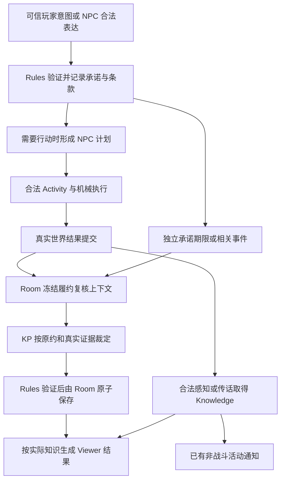

# 承诺与计划：实施方案与阶段进度

2026-09-08。基线：`cloudflare` / `5d4c1512488da9e134314589344c613a60aaf26a`。

状态（2026-09-09）：**第一至第四步已有本地代表性实现与定向证据；第五步真实模型验收尚未闭合。** 用户最新决定将 social 后果拆为四张 JSON 小表：relationshipChanges、newPromises、promiseChanges、newDebts，取代此前“暂不分表”的选择。parser v55 已接通同次填写、独立空数组、校验与统一提交；本次 Viewer 可见的新承诺、关系变化与新债务列表（含空数组）继续传给现有旁白生成和审核，不增加调用。J 批真实模型仍出现台词许诺而 newPromises=[]，上游漏记仍未解决，提交前新增审核方案未获批准。用户已授权仅推进 vNext 直到功能完成。实际实现、全部失败批次与未覆盖范围见[当前回执](vnext-promise-lifecycle-validation.md)。

本文第 1–8 节保留第一步选择的完整实施方向，含后续阶段尚未实现的能力；字段拼写和目录建议不升级为产品规格。第一步只写文档，第二步才修改运行时。共享工作区另有旁白、Ability、Claims/observer-delta、填写与发布等任务的在途改动；第二步保留这些修改，仅在直接相关位置集成，不把其他任务的工作算作本步成果。

| 步骤 | 当前状态 |
| --- | --- |
| 1. 实现方案 | 已完成；数据归属、权限、端到端路径和 A–J 矩阵已写明 |
| 2. 基本闭环 | A/B/C/D 本地定向通过；真实交付、持续保密、拒绝边界和基本恢复/知情已验证 |
| 3. 承诺变化 | E/F/G 本地代表性通过；条件、部分义务、改约/延期/取消与违约历史 |
| 4. 通知与连续性 | H/I 本地定向通过；批量复核、通知/战斗、连续性与调用恢复；真实链路仍随 J 验证 |
| 5. 真实模型验收 | 尚未通过；已补旁白显式空记录和 social 四张小表的本地证据，J 批四表真实复验仍台词许诺而 newPromises=[]；[提交前审核备选](vnext-promise-spoken-consistency-decision.md)未获批准，实际交付与持续义务真实链仍未闭合 |

依据：[主 PRD](../specs/0001-llm-kp-responsibility-contract.md)、[世界事实与知识 SPEC](../specs/0005-world-facts-and-knowledge.md)、[已裁定生命周期合同](vnext-promise-lifecycle-contract-proposal.md)、[领域词表](../../CONTEXT.md)、[两个深 Module](../adr/0006-two-deep-modules-and-one-action-transaction.md)、[粗粒度 Form 与冻结上下文 ADR](../adr/0015-coarse-forms-frozen-context-and-typed-claims.md)。活动部分承接[当前本地回执](vnext-activity-attention-validation.md)。

## 1. 目标和本次决定

能力合同：玩家或 NPC 的结果、尝试、条件和持续性承诺，使用同一权威记录保存原约、适用期限、实际履行、变更、原因和剩余义务；KP 依据真实情境提出裁定，Rules 验证可验证的权限、事实、时序和转换，Room 原子保存；角色只取得世界内实际获知的部分。交付副本验证结果与物品变化，持续保密验证没有到期动作的义务，两者共同验证机制。

| 事项 | 选择的实现方向 |
| --- | --- |
| 承诺与计划 | 承诺保存“答应什么”，计划保存“准备怎么做”。承诺期限独立于计划排期与 Activity 工期；计划不是承诺状态的事实源 |
| 当前义务与过去结果 | 当前仍需做的部分与履约历史分别保存；违约后可以仍欠交付，补交也保留违约记录 |
| KP 裁定入口 | 成立/改约表达进入现有 social 领域；履约复核在实际原因提交后，以服务端冻结的专用上下文调用 KP，再通过 Rules `step` 提交 |
| 自动推进 | 承诺复核接入现有 Room 到期工作队列，以事件和虚构期限触发；保密承诺无需伪造一个角色 Activity |
| 真实执行 | NPC 使用与玩家相同的已注册机械原语、物化与库存语义；补齐 NPC 授权和计划绑定，不按“副本”名称另做操作 |
| 知情与通知 | 正史裁定与角色知识分别记录；从合法取得的新知识接入已有非战斗活动通知，不用承诺状态直接广播 |
| 系统结构 | 沿用 Room Action 与 Rules 两个系统级 Module；不增加独立合同服务、全局任务系统或 D1 活跃状态 |

继续沿用两项产品裁定：未按生效条款完成时记违约并另记原因；延期、修改、取消是否成立由 KP 按情境判断。没有固定双边批准门、宽限期、延期次数或统一声誉处罚。

## 2. 承诺如何记录

`campaignRuntime.promises` 继续是当前承诺的权威状态位置，由事件确定性折叠。拟将其承诺条目收窄为明确类型，保存以下内容：

| 数据 | 内容及责任 |
| --- | --- |
| 身份与原表达 | `promiseId`、双方角色、原发言/可信意图引用、形成事件与虚构时刻；ID 由服务端派生，模型不能自报玩家授权 |
| 条款版本 | 初始条款和每次有效变更；保存版本、生效时刻、改变原因和原表达依据。条款正文与实际相关的对象、人物、地点引用一起保存 |
| 义务条目 | 一项或多项需要满足的内容，具有稳定条目 ID、条件和时间窗口。KP 解释自然语言，数量/地点/持有人等已明确的机械要求另外绑定真实引用 |
| 时间窗口 | 绑定所属虚构时间线，保存明确起点/终点及原约的截止语义；无期限用明确空值。`1h` 等输入档位在成立时解析，不能靠可变计划重新计算 |
| 当前剩余义务 | 按条目表示等待条件、仍需履行、已满足、已解除或条件未成就而结束；保存真实部分进展。名称为实施建议，不能据枚举缩小条款语义 |
| 履约与变更历史 | 保存适用条款版本、实际发生时刻、裁定提交时刻、进展/履约/违约/变更、原因与证据引用。一次裁定可以同时记录违约和仍欠的部分 |
| 复核进度 | 已审阅到的因果前沿与最后裁定引用，用于避免同一证据反复调用；技术失败和未完成的模型请求保留在 Room 工作/调用日志，不变成世界内违约 |

事件保留全部历史，状态中的版本/历史索引由同一事件流折叠；不另建可独立修改的历史表。初次条款不被后续覆盖。`PromiseMade` / 授权继任的消费者统一调用同一个承诺校验和折叠逻辑。

时间只有三种不同用途：

- **承诺期限**：例如一小时内交到手里，决定是否按约。
- **计划排期**：NPC 什么时候准备或重新决定下一步；改变它不自动改变原约。
- **Activity 工期**：实际抄写、移动等行为需要多久，决定机械效果何时完成。

“一小时内”允许在期限内提前真实完成；“一小时后”则按原话解释。程序不把两种表达强制归成同一含义，也不从一小时期限自动推出抄写必耗一小时。

## 3. 小 Interface 与完整数据流

外部仍通过 Room Action 的可信输入和 Rules 的 `step / project / replay`；以下为这两个 Module 内部拟新增/扩展的领域操作，不是新的浏览器写接口。

| 内部操作 | 输入 | 输出与不可越过的责任 |
| --- | --- | --- |
| 成立或提出变更 | 服务器冻结的玩家原意图，或 NPC 的有限知识、真实发言与依据；原承诺版本 | 建立原约，或提交真实变更表达。KP 在上下文充分时可同次提出有依据的条款变更；Rules 重验权限及原版本。玩家有条件接受 NPC 承诺不自动成为自己的义务 |
| 准备履约复核 | 实际原因事件、相关承诺与条款、已结算的虚构时间/作用域、决定性事实与历史 | 冻结复核上下文和读集；缺决定性材料返回不足，不能把零命中当作没有履行 |
| 提交复核裁定 | 一份冻结复核响应：适用条款、逐项判断、真实依据、原因、对剩余义务的影响 | Rules 产生进展、履约、违约、解除或变更事件；Room 保存事件、状态、Receipt 与工作结果。无证据的“完成”不接受 |
| 取得与呈现结果 | 实际感知、交流或其他合法知识传递；特定 Viewer | Knowledge 与 Viewer Claims；NPC 上下文及玩家快照均不直接使用正史中的秘密最新状态 |

拟用一个私有 `resolvePromiseReview` Rules 输入承接复核，而不是为“送信”“保密”“延期”各做入口。它接收领域裁定，不接收 JSON Patch、任意事件列表或自由状态覆写。生成的事件沿用 SPEC 0005 的履约/违约/解除语义，并补足条款变更、部分进展和已复核但无变化的记录；具体事件名在实现中确定。

实际动作与后续语义复核使用关联的根行动：物品已经交付后，即使复核请求网络失败，也不撤销物品转移，更不重做交付。复核成功前只呈现已提交的真实行为，不宣称承诺已经结清。

## 4. KP 怎样裁定，程序验证什么

### 4.1 两份用途不同的上下文

NPC 行动请求继续只看本人知识、位置、资源和已知条款。履约复核请求是主持裁定用途，可以读取相关权威事实，包括其他地点的实际结果；只包含决定性闭包，不灌入整个世界。这两份请求分别冻结和绑定，复核返回值不能附带 NPC 行动或自动授予知识。

复核上下文至少包含：原表达与当前/相关历史条款、原因事件、条款引用对象的权威状态、有关实际执行与知识传播记录、对应时间线的截止点与已结算范围、所需的明确否定事实及可用性。继续复用 RequiredContext 的五态 Availability；技术不可用与世界中不存在分开。

### 4.2 验证分工

| KP 负责 | Rules / Room 负责 |
| --- | --- |
| 原约意味着什么、一次尝试是否足够、替代交付是否被接受、此次延期/取消是否成立 | 原表达来源与权限、原条款版本、引用/数量/位置/持有人/资源/虚构时刻、合法转换与原子提交 |
| 自然语言条件与已发生事实是否匹配，是否还有剩余义务 | 证据真实存在、属于有效因果分支、来自已完成机械结果，且未把未来事实用于过去裁定 |
| 按情境说明履约/违约原因及改约影响 | 历史不能被覆盖；复核幂等；响应和读集不能被替换；错误与私有依据不能越权外发 |

交付物品必须引用真实 ItemEntry 和相关提交；明确交到手里时验证真实持有/转移，放到账台时验证场景及相关放置关系。副本完整性、内容对应等自然语言语义由 KP 对实际物件定义及内容依据作判断；不能声称 hash 或程序已证明任意文本的“完整抄写”。

### 4.3 不把缺证据变成违约

对“没有交付”或“期间没有泄密”的判断，冻结证据必须覆盖条款涉及的主体、地点/对象与时段，包含实际期间事件和相关待决动作的结清情况。完整事件区间只证明这些记录完整，不能自动证明一切尚未固化的幕后行为都没有发生。

持续承诺复核读取已结算期间的真实行为/传播记录与所需的带范围否定依据。上下文能够支持期间守约时，KP 才能提出到期完成；如果世界事实仍是开放留白或相关排程/材料未恢复，保持待裁定，先通过既有世界裁决路径补齐。履约复核不能自己创造“此前肯定没有发生”的事实来结清状态。P03 的成功用例必须包含覆盖该期间的充分权威依据，不能只有空查询结果。

## 5. 计划与真实执行怎么接

当前的差距有确切来源：[计划派生](../../app/_runtime/lib/rules/v2/world-interactions.ts)把 due 同时用于工期和排期，绑定空 `resourceRefs` 与场景目标；[计划资源校验](../../app/_runtime/lib/rules/v2/actor-plans.ts)目前识别 NPC/势力资源；[到期机械执行](../../app/_runtime/lib/rules/v2/compound-actions.ts)虽然存在，但传入空物化集合。它们不能直接证明承诺中的新副本已经创建或转交。

实施选择如下：

1. 承诺写入自身期限。social 可以同时提出 NPC 的具体下一步与工期；服务器按成功分支形成计划和实际 Activity。未提出可执行动作时只保存承诺及待计划工作，不凭承诺文字伪造机械方案；条件承诺不提前执行条件后的效果。
2. 计划绑定承诺条款版本、NPC 实际已知依据，以及本步确实需要的物品/资源、目标和执行内容。已存在物品按精确 entry/definition 与持有关系绑定；允许新对象时绑定既有物化授权、来源和约束，不预创建未来交付物。修订需要新取得的资源时，重新验证其当前合法来源和权限再冻结，不凭旧计划扩大授权，也不把初始资源清单当成永久禁止取得新资源的产品规则。
3. 在 NPC 这一步真正开始时冻结做法、工期、成本和成功/失败后果，复用现有 Activity 开始/完成机制。计划复核、开始执行和完成时刻分开；到期后新决定的另一项耗时动作需要自己的 Activity，不能瞬时补交或再次扣除已度过的同一段时间。
4. 扩展到期 NPC 执行载体，使它能承接现有 materialization、world interaction 和 inventory operation 的私有 Bundle；继续从同一领域 schema 派生模型填写面，并走原完整 validator/lowering/Rules。NPC 身份由持久工作能力绑定，不伪装成玩家、不为玩家入口放宽权限。已有机械执行在同一承接路径保留，替代闭合后删除被替代的窄转换。
5. 抄写采用通用物品/定义创建，放置和交付采用现有库存及空间关系；原件的持有、唯一性和数量保持权威。另一个不同物件的创建/交付走相同操作，禁止名称特判、只有 trace 或用“获得知识”冒充拿到物品。

计划中的承诺引用表示行动依据，不承担判履约职责。违约后仍有义务时，合法补履行计划仍可继续；已失效条款不能继续证明当前义务。秘密解除或改约也不能让 NPC 自动全知：NPC 可以按仍然掌握的旧约知识作出合法行动，行动后按实际生效条款评价；对已知新条款的计划刷新使用相应知识与版本。为此，主持裁定读取的正史条款与 NPC 读取的已知条款分别绑定，不能只将 `status === active` 换成另一个全局状态判断。

## 6. 到期工作、调用与恢复

### 6.1 共用队列，明确工作类别

当前 `DueActivityDescriptor` 及 `authority_due_work.activity_id` 都假定工作拥有 Activity。拟把现有内部工作描述扩成带类别的联合：保留真实 Activity 工作，加入 `promiseReview`，共同携带根 ID、原因事件、相关作用域、虚构时刻与精确哈希；承诺工作携带承诺/版本引用，不生成假 Activity。

Room 继续只持久化 Rules `project` 提供的可执行工作，并在 `step` 提交前重验资格。队列调整集中于现有 `authority_due_work`，其主体索引改为明确的类别/引用，并同步入队、排序、取消、恢复和内部授权消费者；队列不能独立决定承诺状态。现有 Activity 的控制者、模型请求和骰子恢复条件保留。

### 6.2 触发与时序

| 触发 | 行为 |
| --- | --- |
| 新承诺或有效变更 | 注册对应期限/条件复核依据；有具体行为才形成执行计划，普通寒暄不自动成为承诺 |
| 相关已提交世界行为 | 按条款涉及主体、对象、地点和时间范围选择待复核承诺；传播/移动/库存等都走同一权威事件源，不要求事件显式携带 promiseId |
| 持续条款无固定对象引用 | 以主体与相关时间线/行为范围保守发现候选；无法证明事件无关时保留候选，不能因缺一个关键词或精确 ref 漏掉泄密等变化 |
| 承诺期限或条件窗口到达 | 即使没有 NPC 到期动作也能复核；条件未成就、履约与违约由具体条款和证据区分 |
| 纯技术日志、旁白、ACK、无新证据的重连 | 不重复触发模型；一次“复核无变化”的记录也不自我触发 |

候选发现可以多取，语义裁定不能因此自动认定变化。相同因果前沿上的相关承诺合并在一次有界复核请求中；超出决定性上下文预算时保留未完成工作，不能截断后当作全部检查完毕。

同一虚构时刻先结清可能影响本承诺的合法动作及其随机/待决输入，再冻结复核材料；相关动作未结清时不判逾期。生命周期结论以复核提交后的材料呈现；已经合法取得的实际交付或传话信息可以独立通知，不必等承诺结清。剩余非战斗活动按现有通知/待决工作条件继续。不同时间线按各自因果前沿判断，不能借另一角色的未来时刻提前裁定。现实时间、alarm 和重连只恢复工作，不推进世界。

战斗仍由原回合流程推进时间与机械；它产生的真实事实可以成为承诺证据，但承诺复核不得借活动机制推进战斗或插入继续/停止活动的通知选择。

### 6.3 调用与失败

每份冻结复核上下文使用一次专用 KP 语义裁定调用，不另加审核模型；NPC 行动决定与主持履约复核不共用含秘密的请求。响应采用同源严格 schema、唯一 JSON 成员和完整本地验证，不依赖 DeepSeek 的 anyOf 严格模式兜底。

复用当前 HTTP 的模型绑定、调用计数、超时和私有用量捕获。现有三句专项的每 HTTP 7 次上限不因本方案提高，也不把其批次额度外推为新场景授权数值；到第 5 步按新场景冻结批次计划。增加履约复核可能使某次请求需要在下一次恢复中继续，预算不足应在发请求前留下持久待处理工作，不能改用痕迹判成功。若确需提高上限或改变费用安排，先展示具体测量再问用户。

复核根绑定承诺版本集合、原因、证据前沿和 profile/context hash，使用已有 invocation journal 保存精确请求/响应。重复请求不得新增调用、事件或机械效果；已保存响应复用，已发送但结果未知不重采。同一逻辑复核不能借另造根 ID 绕开未知响应限制。真实后续事件引起的重新判断保留与前一工作的因果关系。

物品动作提交与语义裁定分别保持自身原子性。承诺复核失败只留下可恢复/可诊断的技术工作，已经发生的世界变化保留；相关承诺仍待裁定。新动作只在确实依赖未结清结果或同一时序作用域时等待，不用全房间锁扩大阻塞。

## 7. 知情、通知与直接消费者

承诺当前的 [safePromiseFor / 参与者投影](../../app/_runtime/lib/rules/v2/projector.ts)会给双方显示最新 status，新增秘密生命周期时必须一起替换。选定方式是：原约与每次后续事实分别按真实知识取得投影，显示“该角色已知的条款和结果”，不把正史的最新状态、修订数量或私有原因塞进参与者快照。

- 成立时保留实际发言与听者取得；后续看见交付、收到传话或观察到违约时，沿现有证据/主张/知识传播路径保存新取得。
- NPC 说“已经办完”仍按来源主张处理；单独这句话既不证明机械履行，也不自动公开主持裁定。
- 新的生命周期结果使用稳定、可区分的新知识引用，复用 [activityNoticeKnowledgeRefs](../../app/_runtime/lib/rules/v2/activity-progress.ts)；不以覆盖一个旧知识 ID 来期待再次通知。
- 长休中的角色未依法获知时无通知；合法获知后才进入已有注意/继续/停止流程，不自动判定醒来或提前获得休息收益。
- Claims、NPC 决策上下文、玩家快照、候选、错误与恢复统一检查知情范围；正史复核依据不进入 Narration。
- 章节切换保留原约、剩余义务和历史；继任沿原授权合同处理；更正同步条款、判断、依赖工作和知识后果，保留原事件审计。

## 8. 修改范围

下表保留第一步的实施地图；新文件名是当时建议，并非最终文件清单。第二步的实际修改和直接消费者以[本地回执](vnext-promise-lifecycle-validation.md)为准，未完成部分继续留在后续阶段。

| 范围 | 主要文件 | 直接消费者与变化 |
| --- | --- | --- |
| 承诺事实与事件 | `rules/v2/social-commitments.ts`、`rules/v2/model.ts`、`rules/v2/campaign-actions.ts`、`rules/v2/campaign-events.ts`、`rules/v2/events.ts`；拟新增私有 `rules/v2/promise-lifecycle.ts` | social 与底层成立入口、继任、replay、correction 共用条款/履约校验和折叠 |
| 玩家/NPC 表达 | `kp/vnext/proposal-schema.ts`、`kp/vnext/proposal-bundle-lowering.ts`、填写 codec/validator 与 `kp/vnext/proposal-guidance.ts`；`rules/v2/social-interaction.ts`、`rules/v2/world-interactions.ts` | 玩家意图来源证明、NPC 自身权限、同束分支、原条款版本；删除机械 due 与工期的错误绑定 |
| NPC 真实执行 | `rules/v2/actor-plans.ts`、`rules/v2/npc-plan-formation.ts`、`rules/v2/compound-actions.ts`、`rules/v2/authored-materialization.ts`、`rules/v2/inventory-operations.ts`；`kp/vnext/actor-plan-decision.ts` | 精确物品/来源/目标绑定，原机械转换和私有 Bundle 同源验证，真实开始/完成，不靠 trace 交付 |
| 主持复核与上下文 | 拟新增私有 `rules/v2/promise-review.ts` 与 `kp/vnext/promise-review.ts`；`rules/v2/authority-bindings.ts`、`rules/v2/world-facts.ts`、`kp/vnext/context/authority-records.ts` 及其提取/可用性消费者 | 正史依据、已知条款、事件范围与读集分别冻结；私有复核不扩大 NPC 权限 |
| 工作编排和持久化 | `rules/v2/due-activities.ts`、`rules/v2/model.ts`；`room/durable-object.ts`、`room/authority-store.ts`、`room/actor-plan-transport.ts` 及其类型与调用者 | 共用队列的真实联合描述、期限次序、事务内入队、持久请求恢复、共用 HTTP 预算；运输层按实际两个用途调整名称/错误分类 |
| 投影与连续性 | `rules/v2/projector.ts`、`rules/v2/claims.ts`、`rules/v2/npc-decision-context.ts`、`rules/v2/activity-progress.ts`、`rules/v2/correction.ts` | 按知识显示结果、生命周期 Claims、通知新引用、历史与补履行计划、跨章节/继任/更正 |
| 协议与说明 | 相应 runtime/profile 注册及精确 hash 消费者；后续更新 ADR-0015 的实施映射、handoff、对应验证回执与执行日志 | 新事件和公开投影按版本登记，已持久化标识不原地改义；本方案不修改已裁定 SPEC |

源码路径相对 `app/_runtime/lib/`。源码阶段先枚举每个被改类型的真实调用者，再确定最终文件清单；不因为表中列出就重写整文件。

存储选择：继续用当前 Room SQLite 的事件、状态、工作和调用日志。没有新的 D1 业务表、远端资源或外部平台。工作队列的类别化属于现有 DO 存储接缝变更，实施时明确升级路径并验证真实未结工作保存/恢复；不能因旧 0.4 已授权退役，就自动删除后来创建的 vNext 房间或未完成请求。新事件/DTO 使用对应未发布 vNext 版本，旧批次作为历史证据保留；若遇到必须迁移或破坏现役新数据的情况，先停下确认范围。

## 9. 代表性验收与实施顺序

用例均通过 Rules 公共 Interface；跨层样例通过真实本地 Room/HTTP 入口，模型可先用确定性响应驱动。模型 fixture 的正确输入不能替代实际 Rules 验证或真实模型验收。

| 组 | 代表性场景与必要断言 | 合同映射 | 最早阶段 |
| --- | --- | --- | --- |
| A | NPC 在玩家做其他非战斗活动时完成完整副本；真实物件、来源、数量、地点/放置可查；放到账台可履约，“交到手里”则需真正交付；原件保持 | P01、P02 | 第二步 |
| B | 同一机制处理“今晚保密”：有充分期间依据时到期履约，提前真实泄密时违约；无到期执行动作仍会复核 | P03 | 第二步 |
| C | 只有预写痕迹/NPC 自报完成、物件缺失、期间证据不足、用了另一时间线未来事实，均不得记成功或伪造违约；改变 NPC/物件名称不改变路径 | P01、P03、P11、P12 | 第二步 |
| D | 基本链在提交后驱逐/恢复与重复请求；物件、裁定、知识与原响应均不重复；未获知者无秘密状态/通知 | P11、P12 | 第二步 |
| E | 玩家本人主动承诺/提出改约；NPC 双向对象；拒绝 KP 伪造玩家许诺、同意或付款；接受条件不自动承担对价 | 合同 §2、§6、P04、P06 | 第三步 |
| F | 条件未成就与已成就；结果承诺与尝试承诺；部分交付及剩余范围；客观被截与主动失信分别记原因 | P04、P05、P10 | 第三步 |
| G | 无答复延期的接受/不接受两种有依据裁定；替代交付与只换方法；取消计划、拒绝、免除分别判断；失约后改约补交保留原历史 | P06–P09 | 第三步 |
| H | 截止瞬间的合法动作先完成；多时间线、请求/响应/随机/提交/投递各恢复点；长期未决证据不热循环；HTTP 预算耗尽可续办 | P11、P12 | 第四步，基础保护随第二步实现 |
| I | 秘密改约/履行不使 NPC 全知；非战斗活动及长休合法通知；战斗不借该机制推进或弹出活动选择；章节、授权继任、更正后无丢失/复活义务 | P11–P13 | 第四步，知识隔离随第二步实现 |
| J | 真实模型走 A/B 代表性链路，核对条款理解、实际交付、复核结果、可见输出、调用/费用和幂等恢复 | 独立真实验收 | 第五步 |

第二步须同时闭合 A/B/C/D，不能只新增状态字段或交付一个 `execute → fulfilled` 分支。后续阶段补齐变化维度，不把第三/四步的所有能力提前声称可用。

测试组织建议：新增一个承诺行为用例组和一个 Room 纵切用例组，分别承载上表，不按每种承诺再造一套框架。直接接续现有 `tests/kp-vnext-social-commitments.test.mjs`、`tests/kp-vnext-promise-due.test.mjs`、`tests/kp-vnext-actor-plan-due-room.test.ts`、`tests/kp-vnext-activity-attention.test.mjs`、`tests/kp-vnext-time-passage-room.test.ts`、`tests/world-campaign-v2.test.mjs` 的相关用例。命令只运行当步目标文件/用例；共享类型改变时运行一次 typecheck。同一源码状态不重复累加重叠测试数字，不自动进入全项目测试或发布门。

## 10. 本步交付与确认条件

第一步完成条件：实现方向、数据归属、真实输入至投影的数据流、KP/Rules 验证职责、计划与期限分离、直接修改范围和代表性矩阵均已写明，并检查文档链接与 diff。本次不以静态设计宣称 P01–P13 已通过。

目前没有发现需要重新裁定的产品冲突。普通字段和私有实现选择在后续实现中按本方案处理。只有发现现有裁定无法决定且会实质改变产品结果的新选择、需要提高外部预算/改变拓扑，或涉及未授权的数据破坏时，才带着具体影响与最小选择停下来询问；现有 D01/D02 和非战斗范围不重复询问。

本次交付止于第一步。后续运行时实现、代码测试、真实模型批次、本地提交、push 与部署不由这份文档自动启动。
